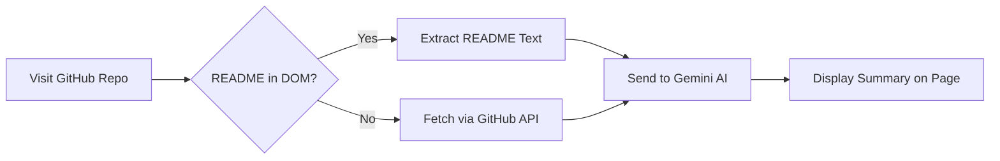

<div align="center">

# 🤖 GitHub Repo Explainer

### *Instantly understand any GitHub repository — powered by AI*

[](https://github.com/karthikmudaliarX/gh_repo_explainer)
[](https://developer.chrome.com/docs/extensions/mv3/)
[](https://ai.google.dev/)
[](LICENSE)

---

**Stop wasting time deciphering complex repositories.**  
GitHub Repo Explainer is a Chrome extension that uses **Google's Gemini AI** to generate a clear, concise summary of any GitHub repository — displayed right at the top of the page.

[Get Started](#-getting-started) · [How It Works](#-how-it-works) · [Tell Me About](#-tell-me-about) · [Contributing](#-contributing)

</div>

---

## ✨ Features

| Feature | Description |
|---------|-------------|
| 🧠 **AI-Powered Summaries** | Leverages Google Gemini AI to generate human-friendly explanations of repositories |
| ⚡ **Instant Injection** | Summaries appear automatically at the top of any GitHub repo page — no clicks needed |
| 🔄 **Smart README Detection** | Tries DOM-first scraping, falls back to the GitHub API for reliability |
| 🌙 **Dark Mode Support** | Seamlessly adapts to GitHub's light and dark themes |
| 🧭 **SPA-Aware Navigation** | Detects GitHub's client-side navigation and re-triggers on page changes |
| 🔐 **Secure Key Storage** | API key stored locally via `chrome.storage.sync` — never leaves your browser |
| ⚙️ **Easy Configuration** | Clean popup UI and a full options page for managing your Gemini API key |

---

## 📸 How It Looks

When you visit any GitHub repository, the extension injects a summary box right at the top:

```
┌──────────────────────────────────────────────────────────────┐
│  🤖 Repo Explanation                                         │
│                                                              │
│  This repository is a React-based dashboard for monitoring   │
│  server health. It provides real-time CPU, memory, and       │
│  network usage charts. Designed for DevOps engineers and     │
│  system administrators.                                      │
└──────────────────────────────────────────────────────────────┘
```

---

## 🚀 Getting Started

### Prerequisites

- **Google Chrome** (or any Chromium-based browser)
- A free **Gemini API Key** from [Google AI Studio](https://aistudio.google.com/app/apikey)

### Installation

1. **Clone the repository**
   ```bash
   git clone https://github.com/karthikmudaliarX/gh_repo_explainer.git
   ```

2. **Load as an unpacked extension**
   - Open `chrome://extensions/` in Chrome
   - Enable **Developer mode** (toggle in the top-right)
   - Click **"Load unpacked"** and select the cloned folder

3. **Set your API key**
   - Click the extension icon in the toolbar
   - Enter your Gemini API key and click **Save**

4. **Navigate to any GitHub repo** — the explanation appears automatically! 🎉

---

## ⚙️ How It Works



1. **Detection** — The content script identifies when you're on a GitHub repository root page (`github.com/{owner}/{repo}`)
2. **README Extraction** — Tries multiple DOM selectors to find the README. If that fails, it calls the GitHub REST API
3. **AI Summarization** — Sends the README text (up to 5,000 chars) to Google Gemini via the background service worker
4. **UI Injection** — The summary is injected into the page in a styled, non-intrusive box that respects GitHub's design language

---

## 📂 Project Structure

```
gh_repo_explainer/
├── manifest.json      # Extension config (Manifest V3)
├── background.js      # Service worker — handles Gemini API calls
├── content.js         # Content script — README detection & UI injection
├── popup.html         # Extension popup — status & settings navigation
├── popup.js           # Popup logic — API key management
├── options.html       # Full options page for API key configuration
├── styles.css         # Injected styles (light + dark mode)
└── plans/             # Development planning docs
```

---

## 🛠️ Tech Stack

| Technology | Usage |
|------------|-------|
| **Chrome Extensions API** (Manifest V3) | Extension framework with service workers |
| **Google Gemini API** | AI-powered text summarization |
| **GitHub REST API** | README fetching fallback |
| **Vanilla JavaScript** | Zero dependencies, lightweight & fast |
| **CSS Variables** | Automatic light/dark theme support |

---

## 🔑 API Key Setup

1. Go to [Google AI Studio](https://aistudio.google.com/app/apikey)
2. Create a new API key (it's free!)
3. Paste it into the extension via:
   - **Popup** → Click the extension icon → Settings → Paste key → Save
   - **Options page** → Right-click extension icon → Options → Paste key → Save

> [!NOTE]
> Your API key is stored securely in Chrome's synced storage and **never** sent anywhere other than Google's Gemini API endpoint.

---

## 💡 Tell Me About

### What is this project?

**GitHub Repo Explainer** was born out of a simple frustration — discovering a new GitHub repository and spending minutes (sometimes more) trying to figure out what it actually does. README files can be long, technical, and overwhelming.

This extension solves that by using AI to give you a **3-4 sentence, plain-English summary** the moment you land on a repo page. Think of it as having a knowledgeable friend sitting next to you, explaining every repo in simple terms.

### Who is it for?

- 🧑‍💻 **Developers** exploring open-source projects
- 📚 **Students** discovering tools and libraries for learning
- 🔍 **Recruiters & Managers** evaluating technical portfolios
- 🚀 **Anyone** who browses GitHub and wants instant clarity

### Why Gemini AI?

Google's Gemini model offers a powerful balance of speed and intelligence. It can digest dense technical documentation and produce concise, human-readable summaries in under a second — making it perfect for a real-time browser extension experience.

### Design Philosophy

- **Zero friction** — no clicks, no buttons. Summaries appear automatically
- **Privacy first** — your API key stays in your browser; no telemetry, no tracking
- **Lightweight** — no npm, no bundler, no build step. Pure vanilla JS that loads instantly
- **GitHub-native** — the injected UI blends seamlessly with GitHub's design system

---

## 🤝 Contributing

Contributions are welcome! Here's how you can help:

1. **Fork** the repository
2. **Create** a feature branch (`git checkout -b feature/awesome-feature`)
3. **Commit** your changes (`git commit -m "Add awesome feature"`)
4. **Push** to the branch (`git push origin feature/awesome-feature`)
5. **Open** a Pull Request

### Ideas for Contributions

- [ ] Add support for GitLab and Bitbucket
- [ ] Cache summaries to avoid repeated API calls
- [ ] Add a "copy summary" button
- [ ] Support multiple AI models (OpenAI, Claude, etc.)
- [ ] Add language translation for summaries
- [ ] Create extension store icons and branding

---

## 📄 License

This project is open source and available under the [MIT License](LICENSE).

---

<div align="center">

**Built with ❤️ by [Karthik](https://github.com/karthikmudaliarX)**

*If you find this useful, give it a ⭐ on GitHub!*

</div>
